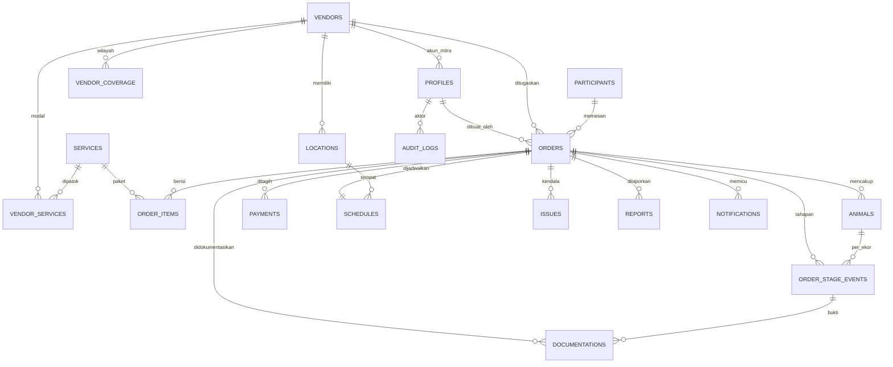

# 05 — DATABASE DESIGN

> **Sukses Aqiqah** — _"Tunaikan Ibadah, Tebarkan Manfaat"_
> Dokumen ini adalah **sumber kebenaran entity** untuk **06_MODULE_BREAKDOWN** dan **16_API_SPEC**.

| Field    | Value                                                          |
| -------- | -------------------------------------------------------------- |
| Dokumen  | 05_DATABASE_DESIGN                                             |
| Versi    | 2.0 — ditulis ulang mengikuti desain ulang skema 20 Agustus     |
| Tanggal  | 2026-09-03                                                     |
| DBMS     | PostgreSQL (Supabase) + Row Level Security                     |
| Status   | **Selaras dengan migration** — 42 migration, 42/42 di cloud     |

> **Cara membaca dokumen ini.** Urutan otoritas kebenaran di project ini adalah
> **migrations → kode → `prd.md` → `docs/`**. Jadi kalau dokumen ini berselisih
> dengan `supabase/migrations/`, yang benar migration-nya. Versi 1.0 sempat
> tertinggal jauh — ia masih menggambarkan `branches`, lima role, dan
> `slaughter_records` yang semuanya sudah dihapus 20 Agustus.

---

## 1. Konvensi

- Semua tabel pakai **`id uuid primary key default gen_random_uuid()`**.
- Timestamp: **`created_at`, `updated_at` (timestamptz, default now())**; trigger `set_updated_at`.
- Soft delete via **`deleted_at timestamptz null`** untuk entitas master.
- Penamaan: `snake_case`, tabel jamak (`orders`, `animals`).
- Enum sebagai **PostgreSQL `enum` type**.
- **RLS aktif di seluruh tabel**; kebijakan berbasis `auth.uid()` + `role` + **`vendor_id`** (lihat §2.1).
- Audit lewat `audit_logs` + trigger `audit_row` pada tabel operasional.

### 1.1 Yang dihapus 20 Agustus, dan kenapa

<!-- schema-history -->

| Dihapus                                | Penggantinya                       | Alasan                                                                                        |
| -------------------------------------- | ---------------------------------- | --------------------------------------------------------------------------------------------- |
| `branches`                             | — (tidak diganti)                  | Operasi berpusat di satu tempat; yang banyak adalah **mitra**, bukan cabang                    |
| `slaughter_records` + `distributions`  | `order_stage_events`               | Tahapan lapangan **bercabang** menurut mode penyaluran; dua tabel tetap tidak bisa mewakilinya |
| `schedules.pic_user_id` sebagai akses  | `orders.vendor_id`                 | Penugasan mitra berdiri sendiri; jadwal kembali jadi sekadar jadwal                            |
| 5 role                                 | 3 role                             | Tanpa cabang, `admin_pusat`/`admin_cabang` kehilangan pembedanya                               |

<!-- /schema-history -->

`regions` **sengaja tidak disentuh** saat desain ulang — isinya 91.599 wilayah
Kemendagri (±3 MB) yang tidak berubah, dan membangunnya ulang berarti push 3 MB
tanpa manfaat.

---

## 2. Entity List — 22 tabel

| #   | Entity               | Deskripsi                                                                     |
| --- | -------------------- | ----------------------------------------------------------------------------- |
| 1   | `profiles`           | Pengguna internal; extend `auth.users`. Membawa `vendor_id` untuk role vendor  |
| 2   | `vendors`            | **Mitra pelaksana** — identitas, kontak, alamat, rekening, perjanjian          |
| 3   | `vendor_services`    | **Modal per mitra** per paket + batas penawaran (min/maks/jeda)                |
| 4   | `vendor_coverage`    | Wilayah layanan tiap mitra                                                     |
| 5   | `services`           | Katalog paket — harga jual **dan** konten halaman depan                        |
| 6   | `locations`          | Titik pelaksanaan (punya koordinat); **milik mitra**                           |
| 7   | `participants`       | Pemesan                                                                        |
| 8   | `orders`             | Order inti (state machine)                                                     |
| 9   | `order_items`        | Rincian paket per order; menyimpan harga jual **dan** modal saat itu           |
| 10  | `animals`            | Hewan per order (ekor)                                                         |
| 11  | `payments`           | Pembayaran & verifikasi                                                        |
| 12  | `schedules`          | Tanggal & lokasi pelaksanaan                                                   |
| 13  | `order_stage_events` | **Tahapan lapangan** — terbit otomatis, berurutan, wajib berbukti              |
| 14  | `stage_requirements` | Tahap mana yang wajib punya bukti                                              |
| 15  | `documentations`     | Foto/video/catatan + status validasi                                           |
| 16  | `reports`            | Laporan peserta (PDF + token publik)                                           |
| 17  | `notifications`      | Outbox notifikasi (WA/Email/Dashboard)                                         |
| 18  | `issues`             | Kendala pada order                                                             |
| 19  | `audit_logs`         | Jejak audit perubahan                                                          |
| 20  | `app_settings`       | Angka yang dibaca RPC **dan** klien (jendela pemesanan, rasio DP)              |
| 21  | `order_counters`     | Penomoran order atomik per bulan                                               |
| 22  | `regions`            | 91.599 wilayah Kemendagri untuk alamat terstruktur                             |

<!-- schema-history -->

### 2.1 Kenapa `vendor_id`, bukan `branch_id`

<!-- /schema-history -->

Inilah perubahan yang paling banyak menyentuh RLS. `can_read_order()`
membandingkan `orders.vendor_id` dengan `profiles.vendor_id`, jadi **penugasan
mitra adalah pintu masuk data**: vendor tidak bisa melihat order apa pun sampai
ia ditugaskan. Trigger `enforce_vendor_assignment` menolak vendor yang mencoba
memindahkan penugasan ke dirinya sendiri.

---

## 3. ERD



---

## 4. Table Definitions

> Kolom audit (`created_at`, `updated_at`) tersirat di semua tabel.

### 4.1 `profiles`

| Kolom      | Tipe                | Ket.                                                        |
| ---------- | ------------------- | ----------------------------------------------------------- |
| id         | uuid PK             | = `auth.users.id`                                           |
| full_name  | text                |                                                             |
| email      | text unique         |                                                             |
| phone      | text                | untuk WA                                                    |
| role       | enum `user_role`    | `superadmin`, `admin`, `vendor`                             |
| vendor_id  | uuid FK→vendors     | wajib untuk role `vendor`, null untuk staf                  |
| is_active  | boolean default true| akun non-aktif membuat `auth_role()` mengembalikan **NULL** |

> `handle_new_user` **tidak** membaca role dari user metadata. Selama pendaftaran
> mandiri terbuka, metadata role berarti siapa pun bisa mendaftar sebagai admin.
> Akun baru lahir sebagai `vendor` **non-aktif**; role ditetapkan superadmin
> lewat UPDATE terpisah.

### 4.2 `vendors`

Identitas mitra, alamat berkode wilayah (`province_code`…`village_code` +
namanya), perjanjian (`agreement_*`), rekening, `daily_capacity`, dan
`service_modes` (array `distribution_mode` — mitra wajib melayani minimal satu).

`code` boleh disunting: ia tidak pernah disalin ke tabel mana pun, dibaca lewat
join, dan path Storage sengaja tidak memakainya.

### 4.3 `vendor_services`

| Kolom             | Tipe          | Ket.                                                    |
| ----------------- | ------------- | ------------------------------------------------------- |
| vendor_id         | uuid FK       | on delete cascade                                       |
| service_id        | uuid FK       | on delete **restrict**                                  |
| vendor_price      | numeric(14,2) | **modal** — selisihnya terhadap `services.price` = margin |
| is_offered        | boolean       |                                                         |
| min_qty / max_qty | int           | batas pesanan; `max_qty` null = tanpa batas             |
| lead_time_hours   | int           | jeda persiapan yang diminta mitra                       |
| meta / notes      | jsonb / text  | rincian modal & catatan kesepakatan                     |

Unik pada `(vendor_id, service_id)`; `max_qty >= min_qty` dijaga constraint.

> ⚠️ `min_qty`/`max_qty`/`lead_time_hours` **dicatat tetapi belum menegakkan**:
> nol pembaca di checkout maupun `assignVendor`.

### 4.4 `services`

| Kolom                     | Tipe                | Ket.                                              |
| ------------------------- | ------------------- | ------------------------------------------------- |
| type                      | enum `service_type` | `aqiqah`, `qurban`, `sedekah_daging`, `nasi_box`   |
| name / slug / description | text                | `slug` dipakai tautan `/checkout?paket={slug}`     |
| price                     | numeric(14,2)       | **harga jual**; modal per mitra di `vendor_services` |
| meta                      | jsonb               | aqiqah `{hasil:{porsi,jenis},cocok_untuk}`; nasi box `{items[]}` |
| tagline, landing_features | text, text[]        | konten kartu halaman depan                        |
| photo_path, photo_alt     | text                | `images/…` = berkas repo; selainnya bucket `public-assets` |
| is_popular                | boolean             | penanda "Terpopuler"                              |
| show_on_landing           | boolean             | dipasarkan; **terpisah** dari `is_active`         |

- `services_slug_active_key` — indeks unik **parsial** (`where deleted_at is null`),
  supaya slug bekas paket terhapus bisa dipakai lagi.
- `services_landing_requires_active` — paket non-aktif tidak boleh dipasarkan.

> Halaman depan **membaca tabel ini** sejak 3 September. Sebelumnya paket &
> harganya hardcode di `lib/constants/site.ts` — kembaran yang pernah menyimpang
> tanpa menghasilkan galat.

### 4.5 `orders`

Selain `order_number` (`IA-YYYYMM-####`, atomik lewat `order_counters`),
`participant_id`, `status`, dan `payment_status`:

| Kolom               | Ket.                                                              |
| ------------------- | ----------------------------------------------------------------- |
| vendor_id           | **pintu masuk akses vendor** — null sampai admin menugaskan        |
| distribution_mode   | `salur` \| `kirim` — **menyetir tahapan**, bukan sekadar validasi  |
| delivery_\*         | alamat terstruktur dari `regions`; nama ikut disimpan sebagai rekaman sejarah |
| public_token        | kunci baca laporan publik                                          |
| created_by          | **null = order tamu**, tertahan di `new` sampai admin memverifikasi |

### 4.6 `order_stage_events`

<!-- schema-history -->

Menggantikan `slaughter_records` + `distributions`.

<!-- /schema-history -->

Daftar tahap **terbit
otomatis** saat mitra ditugaskan (`generate_stage_checklist`), jadi vendor
mengisi yang sudah menunggu — ia tidak bisa mengarang tahap.

Tahap `sembelih` terbit **satu baris per ekor**; sisanya satu baris per order.

---

## 5. Tahapan bercabang

`fulfilment_sequence()` adalah **satu sumber** percabangan — dibaca trigger
penerbit tahap, penegak urutan, dan gerbang kelengkapan bukti:

```
salur : persiapan → sembelih → masak → salur
kirim : persiapan → sembelih → masak → kirim → terkirim
```

`features/stages/sequence.ts` adalah kembarannya di TypeScript, dijaga tes yang
**membaca berkas migration langsung** dan menuntut keduanya identik.

### 5.1 Status order (administratif)

```
new → verified → paid → assigned → in_progress → validation → reporting → completed
```

Plus `on_hold` dan `cancelled`. **Tahapan lapangan tidak lagi jadi status** — ia
bercabang, dan status tidak bisa bercabang.

---

## 6. View

| View               | Menjawab                                                                   |
| ------------------ | -------------------------------------------------------------------------- |
| `v_order_stages`   | Tahap per order beserta bukti & validasinya                                 |
| `v_order_progress` | Progres per order; `stages_total` (baris) ≠ `stages_in_sequence` (tahap)     |
| `v_vendor_kpi`     | Margin, rata-rata siklus, dan berapa order yang buktinya pernah ditolak      |
| `v_open_orders`    | Litmus test: order belum selesai, mitranya, lokasi, tahap berjalan, kendala  |

Keempatnya `security_invoker = on` — menghormati RLS pemanggilnya.

> **Dua angka yang mudah tertukar.** `stages_total` menghitung **baris**,
> `stages_in_sequence` menghitung **tahap dalam rangkaian mode**. Order 3 ekor
> mode `kirim` punya 7 baris untuk 5 tahap; mencampurnya akan mencetak
> "7/5 tahap" kepada pemesan.

---

## 7. Fungsi & Trigger

**35 fungsi, 41 trigger.** Yang menegakkan aturan yang tidak boleh dilewati
jalur mana pun:

| Fungsi                              | Menjaga                                                              |
| ----------------------------------- | -------------------------------------------------------------------- |
| `generate_stage_checklist`          | Tahap terbit otomatis saat mitra ditugaskan                          |
| `enforce_stage_order`               | Lompat tahap ditolak; gerbangnya di `validated`                      |
| `enforce_stage_review`              | Pemisahan tugas — pelapor tidak boleh memvalidasi laporannya sendiri  |
| `enforce_vendor_assignment`         | Vendor tidak bisa memindahkan penugasan ke dirinya sendiri           |
| `enforce_documentation_stage_match` | Bukti yang dilampirkan ke tahap salah ditolak                        |
| `enforce_animal_delete`             | Hewan tidak bisa dihapus setelah tahapnya berjalan                   |
| `enforce_guest_order_verification`  | Order tamu wajib diverifikasi staf sebelum lanjut                    |
| `sync_order_payment`                | `paid_amount` dihitung database, bukan dikirim klien                 |

### 7.1 RPC untuk pengunjung anonim

| RPC                  | Untuk                                                              |
| -------------------- | ------------------------------------------------------------------ |
| `create_guest_order` | Checkout publik — **harga dibaca dari `services`**, kiriman klien diabaikan |
| `get_public_report`  | Laporan bertoken — mengunci bentuk keluaran di level database       |
| `confirm_delivery`   | Pembeli mengonfirmasi penerimaan sendiri; idempoten                 |

Ketiganya `SECURITY DEFINER`. Pengunjung anonim tidak punya akses tabel apa pun
di luar `services` & `regions` — seluruh RLS lain ditujukan `to authenticated`.

---

## 8. Enum

| Enum                          | Nilai                                                                                       |
| ----------------------------- | ------------------------------------------------------------------------------------------- |
| `user_role`                   | `superadmin`, `admin`, `vendor`                                                             |
| `order_status`                | `new`, `verified`, `paid`, `assigned`, `in_progress`, `validation`, `reporting`, `completed`, `on_hold`, `cancelled` |
| `fulfilment_stage`            | `persiapan`, `sembelih`, `masak`, `salur`, `kirim`, `terkirim`                              |
| `stage_event_status`          | `pending`, `reported`, `validated`, `rejected`                                              |
| `distribution_mode`           | `salur`, `kirim`                                                                            |
| `service_type`                | `aqiqah`, `qurban`, `sedekah_daging`, `nasi_box`                                            |
| `animal_species`              | `kambing`, `domba`, `sapi`                                                                  |
| `doc_stage`                   | keenam `fulfilment_stage` + `umum`                                                          |
| `doc_status` / `doc_type`     | `pending`/`approved`/`rejected` · `photo`/`video`/`note`                                    |
| `payment_status`              | `unpaid`, `partial`, `paid`                                                                 |
| `payment_verification_status` | `pending`, `verified`, `rejected`                                                           |
| `issue_severity` / `_status`  | `low`/`medium`/`high` · `open`/`in_progress`/`resolved`                                     |
| `notif_channel` / `_status`   | `whatsapp`/`email`/`dashboard` · `queued`/`sent`/`failed`                                   |

> `animals.status` **dihapus** 27 Agustus — kolom itu tidak tersambung ke apa
> pun, tetapi angkanya dicetak ke pemesan. Progres hewan kini diturunkan dari
> `order_stage_events` yang `validated`.

---

## 9. Storage

Empat bucket. Path dokumentasi: `{YYYY}/{MM}/{order_number}/{stage}/{uuid}.{ext}`
— segmen cabang dibuang dan **tidak** diganti kode mitra, sebab kode bisa berubah
dan order bisa dipindah ke mitra lain.

| Bucket           | Publik | Isi                                          |
| ---------------- | ------ | -------------------------------------------- |
| `documentation`  | tidak  | Bukti lapangan; signed URL berdurasi pendek  |
| `payment-proofs` | tidak  | Bukti transfer                                |
| `reports`        | tidak  | PDF laporan                                   |
| `public-assets`  | **ya** | Foto katalog — memang untuk dipajang publik   |

---

### Referensi silang

- Modul & kepemilikan → `06_MODULE_BREAKDOWN.md`
- Role & kewenangan → `07_USER_ROLES.md`
- Alur kerja → `08_WORKFLOW_MAP.md`
- Status terkini & utang → `../TASKS.md`
