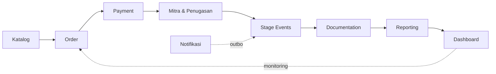

# 06 — MODULE BREAKDOWN

> **Sukses Aqiqah** — _"Tunaikan Ibadah, Tebarkan Manfaat"_
> Entity yang dirujuk mengikuti **05_DATABASE_DESIGN** (sumber kebenaran).

| Field   | Value                                                        |
| ------- | ------------------------------------------------------------ |
| Dokumen | 06_MODULE_BREAKDOWN                                          |
| Versi   | 2.0 — ditulis ulang mengikuti desain ulang skema 20 Agustus   |
| Tanggal | 2026-09-03                                                   |
| Status  | **Selaras dengan `features/` & migration**                    |

> **Kenapa berubah.** v1.0 memecah pekerjaan lapangan jadi dua modul —
> *Slaughter* dan *Distribution* — yang berporos pada `slaughter_records` dan
> `distributions`. Kedua tabel itu dihapus 20 Agustus dan diganti
> `order_stage_events`, sebab tahapan lapangan **bercabang** menurut mode
> penyaluran dan dua tabel tetap tidak bisa mewakilinya.

---

## Peta Modul



Setiap modul: **Tujuan · Entity utama · Fungsi inti · Aktor · Aturan kunci**.

---

## 1. Katalog Paket

- **Tujuan:** Satu sumber untuk apa yang dijual — harga yang ditagih **dan** yang dipajang.
- **Entity:** `services`
- **Kode:** `features/services/`, `server/actions/services.ts`
- **Fungsi inti:** CRUD paket; isi paket (`meta`); konten halaman depan (tagline, fitur, foto); aktif/non-aktif.
- **Aktor:** superadmin
- **Aturan kunci:**
  - Halaman depan **membaca tabel ini** (sejak 3 September) — tidak ada lagi daftar kembar di `lib/constants/site.ts`.
  - `slug` dipakai sebagai tautan `/checkout?paket={slug}`; unik **hanya di antara paket hidup**.
  - Paket non-aktif tidak boleh dipasarkan (`services_landing_requires_active`).
  - Menghapus = soft delete; paket yang pernah dipesan tidak bisa dihapus.

## 2. Order Management

- **Tujuan:** Siklus order dari masuk sampai selesai.
- **Entity:** `orders`, `order_items`, `participants`, `animals`, `order_counters`
- **Kode:** `features/orders/`, `features/checkout/`
- **Fungsi inti:** CRUD order; checkout tamu; nomor unik `IA-YYYYMM-####`; state machine; timeline audit.
- **Aktor:** admin, superadmin; pengunjung anonim lewat `create_guest_order`
- **Aturan kunci:**
  - **Tidak ada scope cabang** — yang menyekat data adalah `vendor_id`.
  - Order tamu (`created_by IS NULL`) tertahan di `new` sampai admin memverifikasi.
  - Harga, total, status, dan jumlah terbayar **tidak pernah datang dari klien**.

## 3. Payment Management

- **Tujuan:** Mencatat & memverifikasi uang masuk.
- **Entity:** `payments`, `orders.paid_amount`
- **Kode:** `features/payments/`
- **Aktor:** admin, superadmin — **vendor sepenuhnya di luar urusan uang**
- **Aturan kunci:**
  - `paid_amount` dihitung trigger `sync_order_payment`, bukan dikirim klien.
  - Bukti transfer diunggah langsung ke Storage; path diverifikasi ulang terhadap nomor order.
  - Gate DP: `paid_amount >= total_amount * min_dp_ratio()`.

## 4. Mitra & Penugasan

- **Tujuan:** Master mitra pelaksana, modal per paket, dan penugasan ke order.
- **Entity:** `vendors`, `vendor_services`, `vendor_coverage`, `locations`, `orders.vendor_id`
- **Kode:** `features/vendors/`, `server/actions/vendors.ts`
- **Aktor:** superadmin (master & modal), admin (penugasan)
- **Aturan kunci:**
  - **Penugasan adalah pintu masuk data vendor** — sebelum ditugaskan, vendor tidak melihat order sama sekali.
  - Menugaskan mitra **menerbitkan daftar tahap** (`generate_stage_checklist`).
  - Modal (`vendor_price`) menentukan margin; selama kosong, dashboard melaporkan margin sebesar seluruh nilai order.
  - Lokasi divalidasi **milik mitra order ini**.

## 5. Stage Events

- **Tujuan:** Mencatat pelaksanaan lapangan yang **bercabang** menurut mode penyaluran.
- **Entity:** `order_stage_events`, `stage_requirements`, `animals`
- **Kode:** `features/stages/`, `server/actions/stages.ts`
- **Aktor:** vendor (melapor), admin/superadmin (memvalidasi)
- **Aturan kunci:**

  ```
  salur : persiapan → sembelih → masak → salur
  kirim : persiapan → sembelih → masak → kirim → terkirim
  ```

  - Daftar tahap **terbit otomatis**; vendor tidak bisa mengarang tahap.
  - Urutan ditegakkan `enforce_stage_order` — lompat tahap ditolak **database**, bukan hanya UI.
  - Tahap `sembelih` terbit **satu baris per ekor**.
  - Pada tahap `kirim`, alamat pembeli **ditampilkan** ke vendor, tidak diketik ulang.
  - `fulfilment_sequence()` satu-satunya sumber percabangan; kembarannya di TypeScript dijaga tes yang membaca migration langsung.

## 6. Documentation Management

- **Tujuan:** Bukti pelaksanaan per tahap.
- **Entity:** `documentations`
- **Kode:** `features/documentation/`
- **Aktor:** vendor (unggah), admin/superadmin (validasi)
- **Aturan kunci:**
  - **Satu tingkat** validasi: `pending` → `approved`/`rejected`; tolak wajib beralasan.
  - **Pemisahan tugas** — pengunggah tidak bisa memvalidasi unggahannya sendiri.
  - Bukti yang dilampirkan ke tahap salah ditolak `enforce_documentation_stage_match`.
  - Gerbang kelengkapan dibaca dari `v_order_progress.missing_doc_stages`, bukan dihitung ulang di TypeScript.
  - Dokumentasi `approved` tidak dapat dihapus.

## 7. Reporting Management

- **Tujuan:** Laporan pelaksanaan untuk pemesan.
- **Entity:** `reports`, `orders.public_token`
- **Kode:** `features/reporting/`, `app/r/[token]`
- **Aktor:** admin, superadmin; pemesan (baca)
- **Aturan kunci:**
  - Laporan **bercerita per tahap**, disusun dari `order_stage_events` yang `validated`.
  - Hanya dokumentasi `approved` yang masuk; kontak peserta tidak pernah ikut.
  - Halaman publik lewat `get_public_report` — RPC mengunci bentuk keluaran di level database.
  - Generate ulang menambah versi **tanpa** mengubah `public_token`.

## 8. Notifikasi

- **Tujuan:** Outbox peristiwa yang perlu ditindaklanjuti.
- **Entity:** `notifications`
- **Kode:** `features/notifications/`
- **Aturan kunci:**
  - **Pemicunya trigger, bukan server action** — peristiwanya datang dari banyak jalan, dan yang lupa memanggil tidak menghasilkan galat.
  - Idempoten lewat `event_key` + indeks unik parsial.
  - ⚠️ **Worker pengirim belum ada** — pengiriman masih manual-klik.

## 9. Dashboard & Monitoring

- **Tujuan:** Menjawab litmus test < 10 detik.
- **Entity:** `v_open_orders`, `v_order_progress`, **`v_vendor_kpi`**
- **Kode:** `features/dashboard/`
- **Aturan kunci:**
  - KPI diukur **per mitra**, bukan per cabang — dengan satu tempat operasi, yang berguna adalah "mitra mana yang lambat, mana yang paling sering buktinya ditolak".
  - Agregat lintas mitra **ditimbang jumlah order**, bukan rata-rata polos.

---

## Matriks Modul × Entity

| Modul              | Entity utama                                          |
| ------------------ | ----------------------------------------------------- |
| Katalog            | `services`                                            |
| Order              | `orders`, `order_items`, `participants`, `animals`     |
| Payment            | `payments`                                            |
| Mitra & Penugasan  | `vendors`, `vendor_services`, `vendor_coverage`, `locations` |
| Stage Events       | `order_stage_events`, `stage_requirements`             |
| Documentation      | `documentations`                                      |
| Reporting          | `reports`                                             |
| Notifikasi         | `notifications`                                       |
| Dashboard          | `v_open_orders`, `v_order_progress`, `v_vendor_kpi`    |
| (lintas)           | `profiles`, `schedules`, `issues`, `audit_logs`, `app_settings`, `regions` |

---

### Referensi silang

- Skema & entity → `05_DATABASE_DESIGN.md`
- Role & kewenangan → `07_USER_ROLES.md`
- Alur kerja → `08_WORKFLOW_MAP.md`
- Status terkini → `../TASKS.md`
