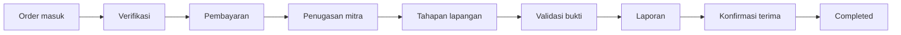
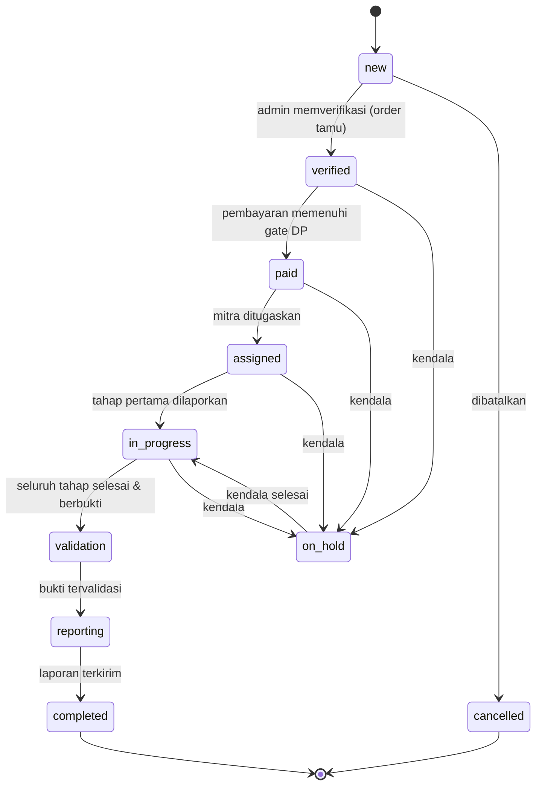
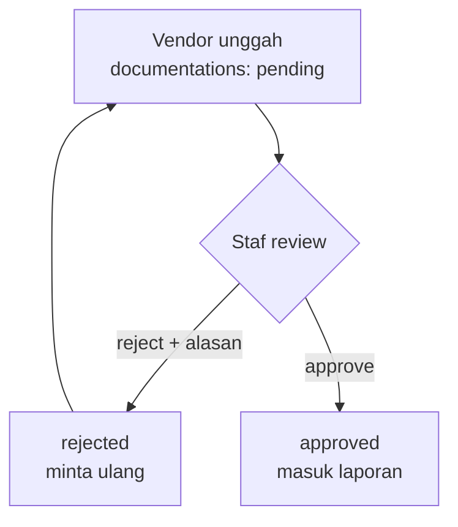
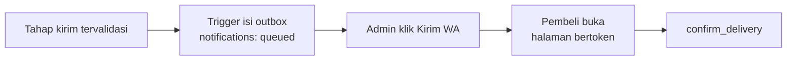
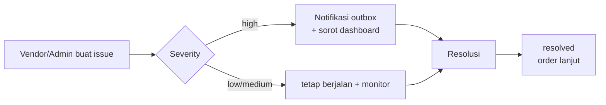

# 08 — WORKFLOW MAP

> **Sukses Aqiqah** — _"Tunaikan Ibadah, Tebarkan Manfaat"_
> Status mengikuti `order_status` di **05_DATABASE_DESIGN §5**.

| Field   | Value                                                        |
| ------- | ------------------------------------------------------------ |
| Dokumen | 08_WORKFLOW_MAP                                              |
| Versi   | 2.0 — ditulis ulang mengikuti desain ulang skema 20 Agustus   |
| Tanggal | 2026-09-03                                                   |
| Status  | **Selaras dengan `features/orders/state-machine.ts`**         |

> **Kenapa berubah.** v1.0 menjadikan tahapan lapangan sebagai **status order**
> (`slaughtering → distribution`). Itu tidak bisa dipertahankan: sejak 20
> Agustus tahapan **bercabang** menurut mode penyaluran, dan status tidak bisa
> bercabang. Keduanya kini dipisah — status mengurus perjalanan administratif,
> `order_stage_events` mengurus pelaksanaan.

---

## 1. Alur End-to-End



## 2. Order State Machine — administratif



**Aturan transisi kunci:**

- `new → verified` — **order tamu wajib melewati ini**; `enforce_guest_order_verification` menahannya sampai staf memeriksa.
- `verified → paid` butuh `paid_amount >= total_amount * min_dp_ratio()`. Angkanya di `app_settings`, dibaca RPC **dan** klien.
- `paid → assigned` menetapkan `orders.vendor_id` — dan **inilah yang menerbitkan daftar tahap** (`generate_stage_checklist`).
- `in_progress → validation` menuntut seluruh tahap dalam rangkaian mode sudah `validated` dan buktinya lengkap.
- `reporting → completed` butuh laporan ter-generate; untuk mode `kirim`, pembeli mengonfirmasi penerimaan lebih dulu.

> **Penugasan mitra bukan sekadar transisi.** Ia pintu masuk data: sebelum
> `vendor_id` terisi, vendor tidak bisa melihat order itu sama sekali.

## 3. Tahapan lapangan — bercabang, bukan status

```
salur : persiapan → sembelih → masak → salur
kirim : persiapan → sembelih → masak → kirim → terkirim
```

`fulfilment_sequence()` adalah satu-satunya sumber percabangan ini — dibaca
trigger penerbit tahap, penegak urutan, dan gerbang kelengkapan bukti.

| Tahap       | Aktor  | Output                                    |
| ----------- | ------ | ----------------------------------------- |
| `persiapan` | vendor | bukti kelayakan hewan                     |
| `sembelih`  | vendor | **satu baris per ekor**                   |
| `masak`     | vendor | bukti pengolahan                          |
| `salur`     | vendor | bukti penyaluran ke penerima manfaat      |
| `kirim`     | vendor | bukti pengantaran; **alamat ditampilkan** |
| `terkirim`  | pembeli| `confirm_delivery()` dari halaman bertoken |

**Urutan ditegakkan database**, bukan UI: `enforce_stage_order` menolak lompat
tahap, dan gerbangnya di `validated` — bukan `reported`.

## 4. Workflow per tahap

| Tahap             | Aktor              | Aksi                          | Output/Status                     |
| ----------------- | ------------------ | ----------------------------- | --------------------------------- |
| **Order**         | pengunjung / admin | Checkout tamu atau input staf | `status=new`, `order_number`      |
| **Verifikasi**    | admin              | Periksa order tamu            | `status=verified`                 |
| **Payment**       | admin              | Catat & verifikasi bukti      | `payment_status`, `status=paid`   |
| **Penugasan**     | admin              | Tetapkan mitra                | `vendor_id`, daftar tahap terbit  |
| **Jadwal**        | admin              | Tanggal & lokasi              | `schedules`                       |
| **Lapangan**      | vendor             | Lapor tahap + unggah bukti    | `order_stage_events.reported`     |
| **Validasi**      | admin              | Setujui/tolak bukti           | `validated` / `rejected`          |
| **Report**        | admin              | Generate & kirim              | `reports` + `public_token`        |
| **Konfirmasi**    | pembeli            | `confirm_delivery()`          | `status=completed`                |
| **Audit**         | sistem             | Catat jejak                   | `audit_logs`                      |

## 5. Sub-Workflow: Validasi Dokumentasi — **satu tingkat**



Dua tingkat pada v1.0 mengandaikan hierarki cabang yang sudah tidak ada.
**Pemisahan tugas tetap berlaku**: pengunggah tidak bisa memvalidasi
unggahannya sendiri, ditegakkan trigger.

Detail → **10_DOCUMENTATION_FLOW**.

## 6. Sub-Workflow: Reporting & Notifikasi



> ⚠️ **Worker pengirim belum ada.** Peristiwanya tercatat sebagai antrian, tapi
> pengirimannya masih manual-klik. "Selesai" saat ini berarti _admin sudah
> dibawa ke WhatsApp_, bukan bukti pesannya terkirim.

Detail → **11_REPORTING_ENGINE** & **18_AUTOMATION_WORKFLOW**.

## 7. Sub-Workflow: Penanganan Kendala



`resolved_by` / `resolved_at` **diturunkan dari status tujuan**, tidak pernah
dikirim klien.

## 8. Pemetaan ke Litmus Test

> _"Berapa order belum selesai, di lokasi mana, **siapa mitranya**, apa kendalanya?"_

Pertanyaannya sendiri ikut berubah: **"siapa PIC-nya" → "siapa mitranya"**.
Dengan satu tempat operasi dan banyak mitra, itulah yang sungguh ingin diketahui.

| Pertanyaan     | Sumber data                                  |
| -------------- | -------------------------------------------- |
| Belum selesai  | `orders.status ∉ {completed, cancelled}`      |
| Lokasi mana    | `schedules.location_id → locations`           |
| Siapa mitranya | **`orders.vendor_id → vendors`**              |
| Tahap berjalan | `order_stage_events` yang belum `validated`   |
| Apa kendalanya | `issues` (`open` / `in_progress`)             |

Disajikan `v_open_orders` — terurut keparahan lalu umur.

---

### Referensi silang

- Status & entity → **05_DATABASE_DESIGN**
- Modul → **06_MODULE_BREAKDOWN**
- Role → **07_USER_ROLES**
- Dokumentasi → **10_DOCUMENTATION_FLOW**
- Status terkini → `../TASKS.md`
