# PRD — Sukses Aqiqah

> *"Tunaikan Ibadah, Tebarkan Manfaat"*
> **Platform Ibadah & Operations Command Center** untuk **Aqiqah**, **Qurban**, dan **Sedekah Daging** — Zakat Sukses.

| Field | Value |
|-------|-------|
| Dokumen | `prd.md` (Product Requirements Document — konsolidasi) |
| Versi | 1.0 |
| Tanggal | 2026-08-06 |
| Pemilik | Zakat Sukses (internal) |
| Status | Living document — acuan utama untuk memulai dari awal |
| Referensi detail | `docs/00_README.md` s.d. `docs/28_HARGA_PROGRAM.md` |

---

## 1. Ringkasan Eksekutif

Sukses Aqiqah adalah platform digital yang menyatukan dua sisi dalam satu sistem:

1. **Sisi Publik (Customer-facing)** — landing page, katalog program & harga, pemesanan/checkout, pembayaran, affiliate/referral, chatbot AI, dan halaman-halaman CMS yang SEO-friendly.
2. **Sisi Internal (Operations Command Center)** — pengelolaan order, penjadwalan, pemotongan, distribusi, dokumentasi berjenjang, pelaporan otomatis, dashboard KPI, notifikasi, dan audit trail.

Tujuannya: mengubah pengelolaan ibadah Aqiqah/Qurban/Sedekah Daging dari proses manual berbasis chat & spreadsheet menjadi satu platform **real-time, terdokumentasi, dan auditable** — sekaligus memberi peserta pengalaman pemesanan dan pelaporan yang transparan.

**Litmus test tunggal** yang menjadi tolok ukur seluruh desain operasional:

> Sistem harus mampu menjawab dalam **< 10 detik**:
> *"Berapa order yang belum selesai, berada di lokasi mana, siapa PIC-nya, dan apa kendalanya?"*

---

## 2. Latar Belakang & Masalah

| Masalah saat ini | Dampak |
|------------------|--------|
| Order tersebar di chat & spreadsheet | Data tidak terpusat, order bisa "hilang" |
| Status order ditanyakan via telepon/chat | Koordinasi lambat, tidak real-time |
| Dokumentasi lapangan tidak terstruktur | Bukti ibadah sulit ditelusuri & divalidasi |
| Laporan peserta dibuat manual | Lambat (15–30 menit/laporan), sering telat |
| Tidak ada jejak audit | Sulit pertanggungjawaban & kepatuhan |
| Pemesanan belum terdigitalisasi penuh | Bergantung pada admin, sulit menskalakan volume |

---

## 3. Visi & Objectives

**Visi:** setiap ekor hewan yang ditunaikan sebagai ibadah dapat **ditelusuri penuh** — dari order, pembayaran, pemotongan, hingga daging sampai ke penerima manfaat — dan setiap peserta menerima laporan transparan tanpa perlu menanyakan status.

| Kode | Objective |
|------|-----------|
| O1 | **Single source of truth** — semua order & status terpusat, bukan di chat/spreadsheet. |
| O2 | **Visibilitas end-to-end** — order dilacak dari tahap Order → Laporan. |
| O3 | **Dokumentasi wajib** — tidak ada order "selesai" tanpa bukti tervalidasi. |
| O4 | **Laporan otomatis** — PDF + halaman publik dibuat otomatis, dibagikan via link unik. |
| O5 | **Dashboard manajemen** — KPI agregat real-time per cabang/lokasi. |
| O6 | **Operasional mobile** — petugas bekerja penuh dari ponsel (PWA, kamera, offline-tolerant). |
| O7 | **Kanal pemesanan digital** — peserta memesan & membayar mandiri lewat website. |
| O8 | **Pertumbuhan** — affiliate/referral & konten CMS/SEO untuk memperluas jangkauan. |

---

## 4. Success Metrics

| Metrik | Baseline (manual) | Target |
|--------|-------------------|--------|
| Waktu menjawab "status order X" | Menit–jam | **< 10 detik** (dashboard) |
| Order dengan dokumentasi lengkap tervalidasi | Tidak terukur | **≥ 95%** |
| Laporan peserta terkirim tepat waktu | Manual, sering telat | **≥ 90%** dalam SLA |
| Waktu pembuatan 1 laporan peserta | 15–30 menit | **< 1 menit** (otomatis) |
| Akurasi data status vs lapangan | Sering selisih | **≥ 98%** |
| Adopsi input order via sistem | 0% | **≥ 90%** |
| Order masuk via checkout mandiri | 0% | tumbuh tiap periode |
| Waktu onboarding admin cabang baru | — | **< 1 hari** |

---

## 5. Persona & Peran (RBAC)

Sistem menerapkan **RBAC** dengan peran berikut (detail: `docs/07_USER_ROLES.md`).

| Role | Enum | Scope | Inti tugas |
|------|------|-------|------------|
| Direktur | `direktur` | Semua cabang | KPI eksekutif, audit. |
| Manager Program | `manager_program` | Semua cabang / program | Kelola program & master data, pantau progres. |
| Admin Pusat | `admin_pusat` | Semua cabang | Validasi dokumentasi tingkat-akhir terpusat. |
| Admin Cabang | `admin_cabang` | 1 cabang | Input & kelola order, jadwal, tetapkan PIC. |
| Petugas Lapangan | `petugas_lapangan` | Tugas yang ditugaskan | Update status, upload dokumentasi. |
| Peserta / Customer | anon (token) | Order miliknya | Pesan, bayar, lihat laporan (tanpa login). |

Prinsip: **least privilege**, **scope by branch** untuk operasional, **pemisahan tugas** (pengupload ≠ validator-1 ≠ validator-akhir).

---

## 6. Ruang Lingkup Produk

### 6.1 Sisi Publik (Customer-facing)
- **Landing & Konten** — landing page, halaman program, halaman proses/alur, halaman CMS (footer menu, FAQ) yang **editable** dan **SEO-friendly** (sitemap, robots, indeksable).
- **Katalog Program & Harga** — Aqiqah (Ekonomi/Favorit/Premium), paket Nasi Box, Qurban, Sedekah Daging; harga terkelola per program (slug + pricing).
- **Checkout / Pemesanan** — pemesanan mandiri termasuk **guest checkout**, ringkasan pesanan, dan pembuatan order.
- **Pembayaran** — integrasi **payment gateway** + pencatatan/verifikasi; gate DP/pelunasan.
- **Affiliate / Referral** — pendaftaran affiliate, kode referral, **tier** komisi, atribusi order.
- **Chatbot AI** — floating assistant (product/business/support knowledge) dengan **human handoff**.
- **Halaman Laporan Publik** — akses read-only via link unik bertoken, unduh PDF.

### 6.2 Sisi Internal (Operations Command Center)
- **Auth & RBAC** — Supabase Auth, sesi, guard route, RLS per cabang.
- **Order Management** — CRUD, nomor unik, **state machine**, filter/pencarian, satu order banyak hewan.
- **Payment Tracking** — status Unpaid/Partial/Paid, gate DP (`min_dp`) & pelunasan.
- **Scheduling & Assignment** — tanggal, lokasi (koordinat Google Maps), PIC.
- **Slaughter & Distribution** — catat pemotongan per hewan, distribusi/penerima, penanda kendala (`issues`).
- **Documentation Management** — upload foto/video/catatan (kamera PWA, offline queue), **validasi 2 tingkat** (Supervisor → Admin Pusat).
- **Reporting Engine** — PDF (React PDF) + halaman publik bertoken + kirim WA.me/Email; narasi laporan.
- **Dashboard & Monitoring** — Executive/Cabang/Lokasi/Petugas dari views KPI.
- **Notification** — alert in-app, reminder SLA (outbox `notifications` + n8n), WA.me/Email.
- **AI Layer** — Executive Summary, Risk Detector, Report Writer (fallback aman tanpa API key).
- **Audit & Settings** — audit trail perubahan penting, master data (cabang, lokasi, layanan, pengguna), branding/template.

### 6.3 Non-Scope (fase ini)
| Tidak dibuat | Alasan |
|--------------|--------|
| Native mobile app (iOS/Android) | PWA cukup untuk kebutuhan lapangan. |
| Multi-tenant SaaS | Sistem internal Zakat Sukses; cukup scoping per cabang. |
| Modul akuntansi/keuangan penuh | Ditangani sistem keuangan terpisah. |
| Integrasi logistik pihak ketiga otomatis | Diarahkan ke fase lanjut (distribution intelligence). |
| AI generatif tanpa nilai bisnis jelas | Hanya use case AI bernilai (lihat `docs/19_AI_LAYER.md`). |

---

## 7. Functional Requirements

Prioritas: **M** = Must, **S** = Should, **C** = Could/lanjutan.

### 7.1 Auth & Authorization
| ID | Requirement | Prio |
|----|-------------|------|
| FR-A1 | Login internal via email + password (Supabase Auth). | M |
| FR-A2 | RBAC untuk seluruh peran. | M |
| FR-A3 | Data ter-scope per cabang untuk Admin Cabang & Petugas. | M |
| FR-A4 | Peserta akses laporan tanpa login via link unik bertoken. | M |
| FR-A5 | Reset password & nonaktifkan akun. | S |

### 7.2 Order Management
| ID | Requirement | Prio |
|----|-------------|------|
| FR-O1 | Buat order jenis: Aqiqah / Qurban / Sedekah Daging. | M |
| FR-O2 | Simpan data peserta, kontak, jumlah/jenis hewan, preferensi, cabang. | M |
| FR-O3 | Nomor unik & status terlihat. | M |
| FR-O4 | Ubah status sesuai state machine. | M |
| FR-O5 | Satu order banyak hewan. | M |
| FR-O6 | Pencarian & filter (status, cabang, lokasi, PIC, tanggal, jenis). | M |
| FR-O7 | Riwayat perubahan tercatat (audit). | M |

### 7.3 Checkout & Katalog Publik
| ID | Requirement | Prio |
|----|-------------|------|
| FR-C1 | Tampilkan katalog program & harga publik (per slug). | M |
| FR-C2 | Checkout mandiri, termasuk guest checkout, membuat order. | M |
| FR-C3 | Ringkasan pesanan sebelum konfirmasi. | M |
| FR-C4 | Atribusi kode referral affiliate pada order. | S |

### 7.4 Payment
| ID | Requirement | Prio |
|----|-------------|------|
| FR-P1 | Catat tagihan & status (Unpaid/Partial/Paid). | M |
| FR-P2 | Integrasi payment gateway + verifikasi. | M |
| FR-P3 | Gate: order tak lanjut ke penjadwalan sebelum lunas **atau** DP ≥ `min_dp`; pelunasan wajib sebelum selesai. | M |
| FR-P4 | Riwayat pembayaran per order. | S |

### 7.5 Scheduling & Assignment
| ID | Requirement | Prio |
|----|-------------|------|
| FR-S1 | Tetapkan tanggal, lokasi, dan PIC. | M |
| FR-S2 | Lihat jadwal per lokasi & per petugas. | M |
| FR-S3 | Lokasi menyimpan koordinat (Google Maps). | M |

### 7.6 Slaughter & Distribution
| ID | Requirement | Prio |
|----|-------------|------|
| FR-SL1 | Catat pemotongan per hewan + waktu. | M |
| FR-SL2 | Catat distribusi: titik/penerima, jumlah paket. | M |
| FR-SL3 | Progres real-time di dashboard. | M |
| FR-SL4 | Penanda kendala/issue pada order. | M |

### 7.7 Documentation
| ID | Requirement | Prio |
|----|-------------|------|
| FR-D1 | Upload foto/video per order/hewan (kamera PWA). | M |
| FR-D2 | Catatan teks pada dokumentasi. | M |
| FR-D3 | Validasi 2 tingkat: Supervisor → Admin Pusat. | M |
| FR-D4 | Status: Pending / Approved / Rejected (+alasan). | M |
| FR-D5 | Order tak bisa "selesai" tanpa dokumentasi tervalidasi. | M |
| FR-D6 | Upload tahan sinyal buruk (offline queue PWA). | M |

### 7.8 Reporting
| ID | Requirement | Prio |
|----|-------------|------|
| FR-R1 | Generate PDF per order (React PDF). | M |
| FR-R2 | Halaman publik per order via link unik. | M |
| FR-R3 | Unduh PDF dari halaman publik. | M |
| FR-R4 | Tampilkan ringkasan, foto/video tervalidasi, status distribusi. | M |
| FR-R5 | Kirim link via WA.me & Email. | M |

### 7.9 Dashboard & Monitoring
| ID | Requirement | Prio |
|----|-------------|------|
| FR-DB1 | Executive Dashboard: KPI agregat semua cabang. | M |
| FR-DB2 | Cabang & Lokasi Dashboard. | M |
| FR-DB3 | Petugas Dashboard: daftar tugas & status. | M |
| FR-DB4 | Jawab litmus test < 10 detik. | M |
| FR-DB5 | Filter & drill-down agregat → order. | M |

### 7.10 Notification
| ID | Requirement | Prio |
|----|-------------|------|
| FR-N1 | Alert in-app untuk tugas & keterlambatan. | M |
| FR-N2 | Reminder otomatis dokumentasi/distribusi/laporan (SLA + n8n). | M |
| FR-N3 | Kirim WA.me & Email saat laporan siap. | M |

### 7.11 Affiliate & Referral
| ID | Requirement | Prio |
|----|-------------|------|
| FR-AF1 | Pendaftaran affiliate & kode referral unik. | S |
| FR-AF2 | Tier komisi affiliate. | S |
| FR-AF3 | Atribusi & rekap order per affiliate. | S |

### 7.12 CMS, SEO & Chatbot
| ID | Requirement | Prio |
|----|-------------|------|
| FR-CMS1 | Halaman footer/menu & FAQ dikelola via CMS. | S |
| FR-CMS2 | Konten terindeks (sitemap XML otomatis, robots). | S |
| FR-CMS3 | Chatbot floating dengan knowledge base + human handoff. | S |

### 7.13 AI Layer
| ID | Requirement | Prio |
|----|-------------|------|
| FR-AI1 | AI Executive Summary atas KPI. | C |
| FR-AI2 | AI Risk Detector (order berisiko telat/bermasalah). | C |
| FR-AI3 | AI Report Writer (narasi laporan, review manusia). | C |

### 7.14 Audit & Settings
| ID | Requirement | Prio |
|----|-------------|------|
| FR-AU1 | Audit trail perubahan status & aksi penting (siapa/kapan/apa). | M |
| FR-AU2 | Kelola master data: cabang, lokasi, layanan, pengguna. | M |
| FR-AU3 | Kelola template laporan & branding. | S |

---

## 8. Non-Functional Requirements

| ID | Kategori | Target |
|----|----------|--------|
| NFR-1 | Performa | Dashboard KPI < 3 dtk; query status < 10 dtk |
| NFR-2 | Skalabilitas | Tahan lonjakan musiman (Qurban) tanpa degradasi |
| NFR-3 | Ketersediaan | Uptime inti ≥ 99% (Vercel/Supabase) |
| NFR-4 | Mobile/PWA | Instalable, responsif, offline-tolerant; Lighthouse PWA pass |
| NFR-5 | Keamanan | RBAC + RLS, signed URL file, enkripsi in-transit (`docs/20`) |
| NFR-6 | Privasi | Data peserta hanya untuk yang berhak; akses ter-scope + audit |
| NFR-7 | Auditability | 100% event penting tercatat |
| NFR-8 | Usability | Onboarding tugas inti < 15 menit |
| NFR-9 | Maintainability | Kode & skema terdokumentasi |
| NFR-10 | Observability | Log & metrik operasional + dashboard alert |
| NFR-11 | Lokalisasi | Antarmuka Bahasa Indonesia (default) |
| NFR-12 | Kompatibilitas | Chrome/Safari/Edge terbaru, Android & iOS via PWA |
| NFR-13 | SEO | Halaman publik terindeks, sitemap & metadata benar |

---

## 9. Alur Bisnis Inti

```mermaid
flowchart LR
    A[Order masuk / Checkout] --> B[Pembayaran diverifikasi]
    B --> C[Penjadwalan & PIC/Lokasi]
    C --> D[Persiapan hewan]
    D --> E[Pemotongan]
    E --> F[Distribusi daging]
    F --> G[Dokumentasi foto/video/catatan]
    G --> H[Validasi Supervisor → Admin Pusat]
    H --> I[Laporan otomatis ke peserta]
    I --> J[Audit & arsip]
```



**Gate penting:** (a) tanpa pembayaran memenuhi gate → tak bisa dijadwalkan; (b) tanpa dokumentasi tervalidasi & pelunasan → order tak bisa `COMPLETED`.

---

## 10. User Stories (inti)

- **US-1** — *Sebagai Admin Cabang*, membuat order dengan jenis layanan & data peserta, agar tercatat terpusat.
- **US-2** — *Sebagai Peserta*, memesan & membayar mandiri via website (termasuk guest), agar tidak bergantung pada admin.
- **US-3** — *Sebagai Admin*, memverifikasi pembayaran, agar order lanjut dijadwalkan.
- **US-4** — *Sebagai Admin Cabang*, menetapkan tanggal/lokasi/PIC, agar penanggung jawab jelas.
- **US-5** — *Sebagai Petugas Lapangan*, mengunggah foto/video & catatan dari ponsel meski sinyal lemah, agar bukti terekam.
- **US-6** — *Sebagai Supervisor lalu Admin Pusat*, memvalidasi dokumentasi, agar hanya bukti sah masuk laporan.
- **US-7** — *Sebagai Peserta*, membuka laporan via link unik tanpa login + unduh PDF.
- **US-8** — *Sebagai Direktur*, memantau KPI agregat & drill-down, agar keputusan cepat.
- **US-9** — *Sebagai Manager Program*, menerima reminder tugas tertunda, agar tidak ada order terbengkalai.
- **US-10** — *Sebagai Affiliate*, mendapat kode referral & rekap komisi, agar termotivasi mereferensikan.

**Definition of Done (global):** memenuhi acceptance criteria, ter-scope sesuai RBAC, menulis audit trail bila relevan, responsif/PWA-friendly, lulus uji (`docs/21`), dan terdokumentasi di spec terkait.

---

## 11. Arsitektur & Tech Stack

| Lapisan | Teknologi |
|---------|-----------|
| Frontend / App | **Next.js 16** (App Router), React 19, Tailwind CSS 4, PWA |
| Backend / Data | **Supabase** (PostgreSQL, Auth, Storage), RLS, RPC/functions |
| Validasi | Zod |
| Pelaporan | React PDF (`@react-pdf/renderer`), `marked` |
| AI | `@anthropic-ai/sdk` (fallback aman tanpa key) |
| Automation | n8n (reminder, dispatch notifikasi) |
| Integrasi | Payment gateway, Google Maps, WA.me, Email/SMTP |
| Hosting | Vercel; Analytics (`@vercel/analytics`) |

Struktur repo (ringkas): `app/` (route publik, `(app)`, `(auth)`, `(site)`, `api`, `checkout`, `r/[token]`), `features/` (ai, chatbot, checkout, cms, customer, dashboard, distribution, documentation, integrations, landing, orders, programs, pwa, seo, users), `server/`, `lib/`, `components/`, `supabase/migrations/`, `automation/`, `docs/`.

**Skema database** diimplementasikan sebagai migration berurutan di `supabase/migrations/` (core tables, order domain, docs/reports/ops, functions/triggers, indexes, views KPI, RLS, RPC, storage, public report, reminders, pricing, affiliate, payments gateway, AI analyses, chatbot, CMS/FAQ, dsb). Acuan desain: `docs/05_DATABASE_DESIGN.md`.

---

## 12. Roadmap / Fase

| Fase | Fokus | Status |
|------|-------|--------|
| **Phase 1 — Operational MVP** | DB/Auth/RBAC, Order, Payment, Schedule, Slaughter/Distribution, Documentation, Dashboard, Reporting, Notification, Automation, Audit | ✅ Selesai (Tahap 1–9, lulus `tsc` + `next build`) |
| **Phase 1.5 — Public Platform** | Landing/CMS/SEO, katalog & harga, checkout + guest, payment gateway, affiliate + tier, chatbot + handoff, rebrand Sukses Aqiqah | ✅ Terimplementasi (lihat migrations & `features/`) |
| **Phase 2 — Intelligence** | AI Executive Summary, Risk Detector, Report Writer; advanced monitoring & distribution intelligence | 🚧 Sebagian (AI layer dengan fallback) |
| **Phase 3 — ImpactLivestock OS** | Manajemen ternak end-to-end, supply/sourcing, analitik lintas program | Direksional |

**Exit criteria Phase 1:** litmus test terjawab < 10 dtk; 1 cabang pilot menjalankan order → laporan end-to-end; ≥ 95% order selesai punya dokumentasi tervalidasi; laporan terkirim otomatis; lulus UAT & checklist keamanan inti.

---

## 13. Aktivasi & Menjalankan

```bash
npm install
# Isi .env.local dengan kredensial Supabase asli (lihat .env.example)
npm run dev        # http://localhost:3000
npm run build      # build produksi
npm run typecheck  # tsc --noEmit
```

Database lokal:
```bash
supabase start
supabase db reset  # apply seluruh migrations + seed
```

Aktivasi produksi: (1) isi `.env.local`; (2) `supabase db reset`; (3) buat user via Supabase Auth, set `role`/`branch_id` di `profiles`; (4) uji login → order → dokumentasi → laporan; (5) opsional: import workflow n8n (`automation/n8n/`), set `N8N_WEBHOOK_SECRET`, isi `ANTHROPIC_API_KEY` untuk AI, konfigurasi payment gateway.

---

## 14. Risiko & Mitigasi

| Risiko | Mitigasi |
|--------|----------|
| Petugas tidak disiplin upload dokumentasi | Gate "selesai" wajib dokumentasi tervalidasi + reminder n8n |
| Lonjakan order Qurban | Arsitektur scalable + managed services; uji performa (`docs/21`) |
| Sinyal lapangan buruk | PWA offline queue untuk upload |
| Kebocoran data peserta | RBAC + RLS + signed URL + audit trail (`docs/20`) |
| Laporan telat | Otomasi generate & kirim (`docs/18`) |
| Kegagalan payment gateway | Fallback pencatatan/verifikasi manual + retry |
| Konten publik tidak terindeks | Sitemap/robots otomatis + audit SEO |

---

## 15. Referensi

Dokumentasi arsitektur & spec lengkap ada di `docs/` (00–28), antara lain:
`01_PROJECT_VISION`, `02_BUSINESS_REQUIREMENTS`, `03_PRODUCT_REQUIREMENTS`, `04_SYSTEM_ARCHITECTURE`, `05_DATABASE_DESIGN`, `06_MODULE_BREAKDOWN`, `07_USER_ROLES`, `08_WORKFLOW_MAP`, `09_DASHBOARD_SPEC`, `10_DOCUMENTATION_FLOW`, `11_REPORTING_ENGINE`, `12_NOTIFICATION_SYSTEM`, `13_PWA_ARCHITECTURE`, `16_API_SPEC`, `18_AUTOMATION_WORKFLOW`, `19_AI_LAYER`, `20_SECURITY_CHECKLIST`, `21_TESTING_PLAN`, `22_DEPLOYMENT_PLAN`, `23_MVP_ROADMAP`, `25_BUILD_SEQUENCE`, `26_CHAT_BOT`, `27_PAGE_MENU`, `28_HARGA_PROGRAM`.